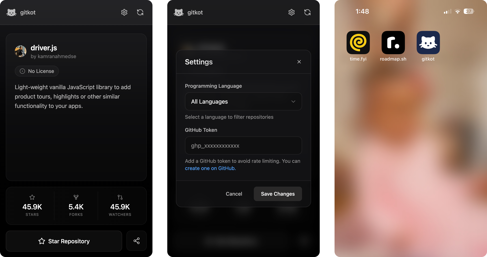

  
  <h1>gitkot.com</h1>
  
TikTok but to explore GitHub repositories

  

    
  

 

 

## Contributions

Feel free to submit pull requests, create issues or spread the word.

## License

MIT &copy; [Kamran Ahmed](https://twitter.com/kamrify)
